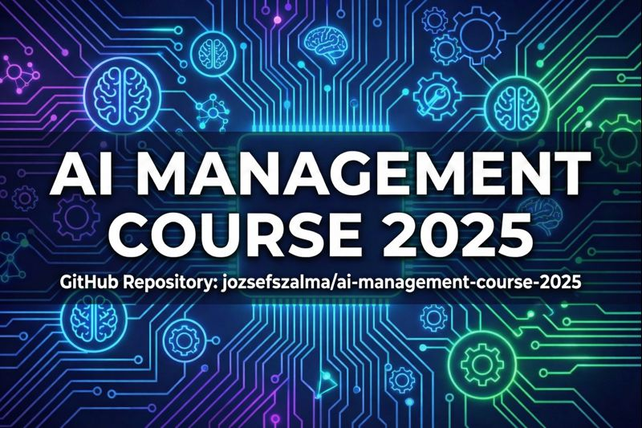

# AI Management Course

- **Author**: [Jozsef Szalma](https://www.linkedin.com/in/szalma/)
- **License**: [CC BY 4.0](https://creativecommons.org/licenses/by/4.0/)
- **Audience**: job-seeking IT professionals (non-developer backgrounds)
- **Scope**: architecture, procurement, risks, governance, compliance, integration patterns
- **How to cite**: Szalma, J. (2025). _AI Management Course._ Retrieved from https://github.com/jozsefszalma/ai-management-course-2025
- **Commercial support**: [Arrange a meeting](https://app.simplymeet.me/szalma)
- **Disclaimer: Not legal advice; verify regulatory timelines with official sources.**
- **Version (Last updated)**: v1.0 (2025-12-16)

## Why
In November - December of 2025 I helped a couple of my job-seeking friends to upskill in AI management.
Most of the people involved were IT professionals with non-developer backgrounds, thus we focused on architecture, procurement, risks, governance, compliance, integration patterns and the scope intentionally excluded hands-on implementation.

The below are my cleaned up 'course notes' on the topics we covered.

## How to Use
- We discussed these topics in 5 evenings, but I recommend spending significantly more study time on these topics.
- I included 'Transformers 101' to be able to discuss how the information flows inside an LLM and to be able to anchor the failure modes to the architectural and training choices, however prefaced the unit with the disclaimer that knowing the guts of transformers is not mandatory for our purposes.
- Treat the below as an outline of the topics to research and understand.
- If you use these notes in your own company docs, blogs, or training, please link back to this repository.

---

## Table of Contents

- [Preparation](#preparation)
- [Unit 1 - Generative AI Landscape](#unit-1---generative-ai-landscape)
- [Unit 2 - Transformers 101](#unit-2---transformers-101)
- [Unit 3 - Vendors, Token Economics, and Cost Control](#unit-3---vendors-token-economics-and-cost-control)
- [Unit 4 - Security and Governance](#unit-4---security-and-governance)
- [Unit 5 - Compliance](#unit-5---compliance)
- [Unit 6 - Integration Patterns](#unit-6---integration-patterns)
- [Out of Scope](#out-of-scope)
- [Glossary](#glossary)

## Preparation

### Accounts

- Create at least a free account with major LLM providers and enable 2FA:
  - ChatGPT: https://chatgpt.com/
  - Claude: https://claude.ai/
  - Gemini: https://gemini.google.com/app

- Register for "sandbox/playground" environments (some of these may require payment):
  - OpenAI Playground: https://platform.openai.com/playground
  - Anthropic Console: https://console.anthropic.com/
  - Google AI Studio: https://aistudio.google.com/

- Adjust privacy settings where available (e.g., opt out of data being used for training).

### Bookmark these resources

- Tokenizers and prompt sizing:
  - OpenAI Tokenizer: https://platform.openai.com/tokenizer
  - Token estimation tool: https://michaelcurrin.github.io/token-translator/
- Local model tooling and ecosystems:
  - Ollama: https://ollama.com/
  - LM Studio: https://lmstudio.ai/
  - Hugging Face: https://huggingface.co/

### IT Basics
- APIs and JSON:
  - Web APIs: https://en.wikipedia.org/wiki/Web_API
  - JSON basics: https://en.wikipedia.org/wiki/JSON
  - JSON Schema helper: https://jsonschema.dev/

- Hardware concepts:
  - GPU: https://en.wikipedia.org/wiki/Graphics_processing_unit
  - NPU: https://en.wikipedia.org/wiki/Neural_processing_unit

- Vector DB concepts (for embeddings / RAG):
  - AWS explainer: https://aws.amazon.com/what-is/vector-databases/
  - Wikipedia: https://en.wikipedia.org/wiki/Vector_database

### Intro videos

- AI basics mini-course:
  - https://cursor.com/learn

- Quick foundational concepts:
  - https://www.youtube.com/watch?v=zYGDpG-pTho
  - https://www.youtube.com/watch?v=gl1r1XV0SLw
  - https://www.youtube.com/watch?v=nKSk_TiR8YA

- Approachable NLP / LLM series (older but still relevant):
  - Computerphile GPT playlist: https://www.youtube.com/playlist?list=PLxD9nMl0rR9GJnC27Y1Mw2iagvQ0rOzaJ

- Deep dives (optional, only if you want more):
  - "A Hacker’s Guide to Language Models" (Jeremy Howard): https://www.youtube.com/watch?v=jkrNMKz9pWU
  - "Intro to Large Language Models" (Andrej Karpathy): https://www.youtube.com/watch?v=zjkBMFhNj_g
  - The math of Neural Networks (3Blue1Brown): https://www.3blue1brown.com/topics/neural-networks
  - Statistics (Khan Academy): https://www.youtube.com/playlist?list=PLU5aQXLWR3_xDN0M2ZeZ_zHIia0e42_3O  
  - Google AI Agents whitepaper: https://www.kaggle.com/whitepaper-agents
  - AI Agent course: https://huggingface.co/learn/agents-course/en/unit0/introduction
---

## Unit 1 - Generative AI Landscape

### Topics

- Large Language Models (LLMs): what they are and why they matter in enterprise settings
- Capabilities and limitations:
  - autoregressive next-token generation
  - limited context window
  - hallucinations / "confidently wrong answers"
  - limited interpretability
  - multimodal direction
- Critiques and realistic expectations
  - Yann LeCun's critique: https://youtu.be/yUmDRxV0krg?t=1101
  - Ethan Mollick's "Jagged Frontier": https://youtu.be/dPJ6Bxsky0s?t=851
- Workarounds and error correction:
  - RAG (retrieval-augmented generation)
  - guardrails
  - context engineering
  - evaluations and monitoring
  - interpretability (as a research discipline, often a low priority and resource-intensive activity)
- Providers and model access patterns:
  - closed APIs vs open-source vs open-weight
- Embeddings and embedding models (as the backbone of RAG)
- Common product patterns:
  - translate, summarize, classify, extract, generate
  - structured output and tool-calls
  - workflows and agents
  - human-in-the-loop vs autonomous operation
- Project management for probabilistic systems:
  - probabilistic vs deterministic software
  - model/data drift (why "vibe check" is not enough)
  - buy vs build vs wrappers
  - use-case scorecards (impact × feasibility × risk × data readiness)

### Job interview highlights

#### 1) Core limitations to articulate clearly

- **Autoregressive generation**: same compute expended for each token generated, every additional token is another chance to diverge (longer outputs increase error probability).
- **Context window constraints**: you trade off missing crucial context vs higher cost and performance degradation when stuffing too much in.
- **Interpretability**: most production deployments are effectively "black box" with partial observability.

#### 2) Workarounds (and their caveats)

- **RAG** reduces hallucination by injecting relevant context, but "relevance" is hard in unstructured corpora.
- **Embeddings + vector DBs + ANN search** are common, but similarity ≠ relevance; cutoff thresholds are tricky.
- **Graph-RAG / agentic RAG** is a likely future direction: an agent walks a knowledge graph / document graph to select context more intelligently.
- **Context engineering** is the umbrella term for managing what goes into the context window, when, and why.
- **Evals & monitoring**: treat drift as a real production risk (see LLMOps as relevant concept); "LLM-as-judge" is common (with its own risks).

#### 3) Project management reality check

- AI outcomes are **probabilistic**, repeatability is a challenge, especially important for backend enterprise use cases.
- Many AI projects behave like **R&D**, and forcing them into Agile can create friction (but most orgs try anyway).

---

## Unit 2 - Transformers 101

### Topics

- Decoder-only transformers
- Information flow:
  - tokenization → embeddings → attention + MLP blocks → output distribution → decoding → detokenization
- Sampling and decoding:
  - temperature, top-k, etc.
  - determinism is not guaranteed in managed APIs even at "temperature 0"
- Scale:
  - parameter count and memory requirements
  - KV cache as a memory bottleneck
  - LLMs vs SLMs and when smaller wins (narrow domains)
  - Train vs inference compute (test-time compute / reasoning tokens)
  - Rule-of-thumb for memory sizing: Model memory in GB ≈ parameters (in billions) × bytes per parameter + KV cache
- Training concepts:
  - pretraining, fine-tuning, reinforcement learning (RLHF)
  - data poisoning as a risk
  - how training incentives contribute to hallucinations
  - "context rot" and needle-in-a-haystack
- Prompting vs context engineering
- Prompt hierarchy (system vs developer vs user vs tool context)
- Context-driven bias / priming / roleplay
- Mixture of Experts (MoE)
  - consist of several specialized "expert" sub-networks
  - a gating network which experts are needed for a specific token
  - improves inference speed and reduces cost

### Job interview highlights 

#### Transformers: explain the pipeline in plain English

- Input text becomes **tokens** via a tokenizer.
- Tokens map to **embedding vectors** (learned numeric representations).
- **Positional encoding** adds ordering information.
- Stacked transformer blocks combine:
  - **self-attention**, routes and weights token-to-token influence. An intuitive way to understand the self-attention mechanism is to think of it as a learned method to weigh the relative importance of the tokens in relation to all other tokens.
  - **MLP** - Multilayer Perceptron, where much of the factual/conceptual knowledge is assumed to be stored.
- Output is a probability distribution over next tokens; a decoding strategy selects the next token.

#### KV cache: why it matters

- KV cache stores prior token "Key/Value" states to speed up generation.
- Tradeoff: **faster inference** vs **high memory use** → often a real production bottleneck.

#### Sampling:

- Higher temperature/top-k → more creative but higher risk of errors.
- No guaranteed repeatability, even with temperature 0 and greedy decoding (selecting the highest probability token) due to provider routing, model updates, or other numerical differences (e.g., rounding errors).
- MoE architectures can add additional nondeterminism depending on implementation.

#### Training & hallucinations (practical framing)

- Models are trained to **continue text** and often rewarded for "helpfulness", not calibration.
- Introducing brand-new knowledge via fine-tuning is risky; prefer **RAG** for new/volatile facts.
- Long-context performance can degrade in the middle of the window ("needle in the haystack" and "context rot").

### Homework

- Play with interactive transformer visualizations:
  - https://poloclub.github.io/transformer-explainer/
  - https://interactive-transformer.vercel.app/#intro

- Become familiar with the tokenizer: https://platform.openai.com/tokenizer

- Reading:
  - OWASP GenAI: Data and model poisoning: https://genai.owasp.org/llmrisk/llm042025-data-and-model-poisoning/
  - Context windows: https://platform.claude.com/docs/en/build-with-claude/context-windows

---

## Unit 3 - Vendors, Token Economics, and Cost Control

### Topics 

- Pricing basics (details vary by provider!):
  - input tokens vs output tokens
  - why output tokens often cost more
  - usually: searches (priced as input, but hidden), thinking tokens (priced as output, but hidden)

- Closed APIs vs open-source vs open-weight

- Opacity of the offerings does matter:
  - quantization (model trained at 16-bit precision, later quantized to e.g. 4-bits per parameter)
  - distillation
  - routing to fallback models

- SLAs:
  - uptime and error rate are common
  - latency KPIs (time-to-first-token, tokens/sec) are often not committed to

- Cost levers:
  - caching and prompt reuse
  - batching (slower completion for lower price)
  - switching to fine-tuned SLMs for narrow tasks
  - context engineering (truncate, summarize, retrieve just-in-time)

- Latency: what to measure and why

### Job interview highlights

#### Pricing models you should be able to explain

- B2B LLM APIs typically charge:
  - **$X per million input tokens**
  - **$Y per million output tokens**
- Reserved capacity is a common offering in enterprise clouds (a "use it or lose it within a time slice" model).
- Batch processing is often cheaper, with delayed completion (e.g., within 24 hours).

#### "Wild West" realities

- Many providers don’t guarantee time-to-first-token or tokens/sec in SLAs.
- Providers may:
  - quantize/distill under the hood
  - route requests dynamically to different model variants
- Even "open-weight" models can be run in a quantized (degraded) precision by API hosts.

#### Cost control strategies

- **Prompt caching**: repeated prefixes can be discounted by some providers.
- **In-house hosting** can reduce per-token costs, but consider **total cost of ownership**:
  - infra, reliability, observability
  - specialized staffing
- **Context engineering** is both a quality and a cost discipline.

### Homework

- Vendor/platform comparisons (keep in mind: this is a marketing material, but useful to gain an overview): https://xenoss.io/blog/openai-vs-anthropic-vs-google-gemini-enterprise-llm-platform-guide
- Pricing comparisons: https://www.llm-prices.com/
- Open-source vs open-weight: https://opensource.org/ai/open-weights
- Azure provisioned throughput (example of reserved capacity): https://learn.microsoft.com/en-us/azure/ai-foundry/openai/concepts/provisioned-throughput

### Deep Dive (optional)
- Context Engineering for Agents: https://github.com/humanlayer/12-factor-agents
- Quantization overview: https://newsletter.maartengrootendorst.com/p/a-visual-guide-to-quantization
- Prompt caching: https://platform.openai.com/docs/guides/prompt-caching
- Inference performance benchmarking: https://docs.nvidia.com/nim/benchmarking/llm/latest/index.html

---

## Unit 4 - Security and Governance

### Topics 

Threats, risks, and mitigations:

| Risk / Threat | Mitigation |
|---|---|
| Shadow AI | Provide officially supported tools |
| Data residency & sovereignty | Select providers with EU residency and GDPR compliance |
| Model deprecation / retirements | End-to-end lifecycle management (you WILL need developers involved after deployment) |
| Open-source vs open-weight | Assume you **do not** have access to the training data or training code; unknown biases and possibility of model poisoning should factor into the security decisions |
| Supply chain attacks (Python libs, pickle files) | Use trusted libraries; mandate **safetensors** instead of relying on PyTorch defaults |
| Licensing issues | MIT and Apache are generally fine, however (!) some open weight models use modified MIT / Apache license with e.g., revenue limits. Otherwise require review |
| Prompt injections (data → "executable instructions" parallels) | Input validation is problematic; first ask: do you really need external/untrusted input in the context |
| Jailbreaks | Zero trust; least privilege |
| Data exfiltration / PII leakage | minimize and anonymize PII, constrain tools, add approvals, log everything, and assume exfil is possible |
| Tool abuse | Zero trust; least privilege |
| Design anti-patterns (no access controls, no least privilege, open attack vectors + sensitive data access, exposed MCP) | Zero trust (plus proper access controls and least-privileged scopes) |
| Bias (training data skews: Reddit/4chan/academia, etc.) | Evals, evals, and more evals (and accept residual risk) |
| Reputation risks | Challenge the need for customer-facing chatbots; avoid if not necessary |
| Emerging threats (AI whistleblowers, data poisoning and sleeper agents) | Zero trust; least privilege; treat agents like employees you have no recourse to |

### Job interview highlights

#### 1) Standard software rules still apply

- Input sanitization is still required.
- Model output must be treated as **untrusted input** in downstream systems.
- Monitor license compliance in the supply chain.
- Supply chain risks still exist via dependencies **plus** new attack surfaces:
  - model files (e.g., unsafe serialization formats)
  - tokenizers, tool wrappers, orchestration/workflow code
  - agent policies/adapters
  - datasets, prompt templates, eval artifacts
- For agents, **least privilege** and **zero trust** still apply.

#### 2) What is special about AI security

- Anything inside the context window can be interpreted as instructions.
- System prompts are **not** a security boundary.
- Real boundaries are:
  - tool gating and explicit permissions
  - sandboxing
  - network egress controls
  - human approval (when impact is high)
- Guardrails can help, but assume bypass is possible → defense in depth:
  - constrained tools
  - logging & anomaly detection
  - kill-switches
  - least privilege everywhere

#### 3) Example kill chain

Scenario: a no-code/low-code AI agent triages a Gmail inbox.

1. Broad mailbox/Drive scopes are granted + autonomous tool use (**excessive agency**).
2. No human-in-the-loop (actions aren’t contingent on review).
3. Agent reads every email and decides actions (spam/move/respond/escalate).
4. Attacker uses prompt injection via:
   - hidden text in an email
   - calendar invites
   - PDF attachments
5. Agent exfiltrates sensitive emails or Drive files to attacker.

#### 4) Audit / code review questions

- Does the agent really need unrestricted search access?
  - Anything the agent can read becomes a prompt-injection vector.
- Could sensitive data enter the context window or tool-access scope and be exfiltrated?
- Does the agent really need PII at all?
- Does the agent only access the current user's data, or can it select users by itself?
- Can the agent communicate externally?
  - If yes: allowlist domains/endpoints only.
- Which tool actions require explicit confirmation?
  - Especially send/share/export/delete.
- Do we keep immutable, reviewable audit logs of tool calls and data access?
- What is the maximum blast radius per run?

### Homework

- Practical LLM security guidance (NVIDIA AI Red Team): https://developer.nvidia.com/blog/practical-llm-security-advice-from-the-nvidia-ai-red-team/
- Semantic prompt injections in agentic AI: https://developer.nvidia.com/blog/securing-agentic-ai-how-semantic-prompt-injections-bypass-ai-guardrails/
- LLM Guard project: https://github.com/protectai/llm-guard
- What did the unknown author mean by "The 'S' in 'MCP' stands for Security"? See: https://modelcontextprotocol.io/docs/getting-started/intro

---

## Unit 5 - Compliance

### EU AI Act
**Note (Dec 2025)**: The EU AI Act rollout is still evolving, with implementation guidance and timelines subject to change (including possible delays). Always check the latest Commission updates before locking in compliance plans.

- First broad AI regulation in the EU.
- Risk-based approach:
  - minimal → limited → high-risk → prohibited
- Applies across lifecycle roles:
  - providers, deployers, importers, distributors

#### What counts as "high-risk" (examples)

AI used in:
- hiring & HR
- credit scoring
- education exams
- essential services
- critical infrastructure
- medical devices
- law enforcement and migration

High-risk systems require:
- risk management
- data governance + logging
- human oversight
- robustness + transparency
- documentation

#### What is typically *not* high-risk

- Most productivity tools (code assistants, office copilots, general-help chatbots),
  unless they make or automate high-impact decisions.

### GPAI and "systemic risk" - thresholds and why it matters

The EU AI Act sets obligations for **General-Purpose AI (GPAI)** model providers, and a **stricter "systemic-risk"** tier for the most capable GPAI models.

#### Two compute thresholds get mixed up - they mean different things

**Important:** In this context, “compute” refers to **cumulative training compute** (total floating-point operations over the training run), **not FLOPs** (operations per second).

**1) "Is this a GPAI model at all?" (scope indicator in Commission guidance): ~10^23 FLOP (total training compute)**

Some Commission-facing guidance uses an **indicative criterion** for when a model should be treated as a **GPAI model**: **training compute > 10^23 floating-point operations (FLOP)** *and* the model can generate **language** (text/audio), **text-to-image**, or **text-to-video**.  
This is meant as a **practical indicator**, not a perfect or exclusive definition - borderline cases still need a case-by-case assessment.   

See: https://digital-strategy.ec.europa.eu/en/news/commission-publishes-guidelines-providers-general-purpose-ai-models

**2) "Is this a systemic-risk GPAI model?" (AI Act presumption): 10^25 FLOP (total training compute)**

Separately, the AI Act introduces a **rebuttable presumption** that a GPAI model is **systemic-risk** if it was trained with **cumulative compute > 10^25 FLOP**.  
In addition, the Commission can **designate** a model as systemic-risk based on other criteria, and providers may be able to **rebut** the presumption depending on the circumstances.  

See: https://artificialintelligenceact.eu/high-level-summary/

#### Ballpark **total** training compute of already obsolete models (third-party estimates)
- GPT-4 ≈ 2.1×10^25 FLOP  
- Llama 3.1-405B ≈ 3.8×10^25 FLOP  

See: https://epoch.ai/gradient-updates/how-big-could-an-ai-manhattan-project-get

#### Why this matters in enterprise governance

Even if you are just a deployer, whether a supplier’s model falls into the **systemic-risk tier** affects **supplier selection**, **contracting**, **risk assessment**, and **assurance expectations** (documentation, evaluations, monitoring, incident handling, etc.).

### Why GDPR matters for AI

- Prompts, training data, logs, and outputs can contain personal data.
- GDPR principles apply:
  - lawful basis, minimization, retention
  - data subject rights
  - DPIAs where required
- Even with a third-party model provider, you’re often still the controller for how you use personal data.

### Why NIS2 matters for AI

- If you’re an essential/important entity, AI becomes part of your critical infrastructure posture.
- Expect requirements around:
  - risk management
  - incident handling
  - logging
  - supply-chain security for the integrated environment (APIs, models, data pipelines)

## Unit 6 - Integration Patterns

### Topics

#### 1) Common enterprise integration patterns

##### A) Services via an API ("intelligence as a service")

**Pattern:** Expose an AI capability through a managed service/API that downstream apps call, rather than embedding LLM calls everywhere.

**Where it fits:**
- summarization, classification, extraction, translation, AI-based OCR (arguably, recommender and search systems based on neural networks also belong here)
- "assistive intelligence" in customer support, knowledge ops, reporting
- centralized compliance needs (logging, retention, policy enforcement)

**Why enterprises like it:**
- **one place to implement governance** (auth, audit, redaction, policy)
- consistent prompt templates and versioning
- easier to monitor cost/latency and enforce quotas
- reduces vendor lock-in risk (swap models behind the API)

**Key design points:**
- **contract-first outputs** (JSON schema / typed DTOs)
- strict timeouts, retries, idempotency, backoff
- caching for common prefixes / repeated prompts
- response filtering and safety checks before returning to callers

##### B) Workflow step augmentation (LLM inside DAGs, BPM/RPA)

**Pattern:** Insert an LLM step as a node inside a deterministic workflow / DAG.

**Where it fits:**
- document triage ("route this to team A/B/C")
- form/document extraction as a pre-step for downstream systems
- drafting steps: write email, propose ticket response, propose report

**Why it’s attractive:**
- you keep the overall process **deterministic and auditable**
- you can add **human approvals** naturally at workflow gates
- easier to scope "blast radius" (LLM affects one step, not the whole system)

**Key design points:**
- treat LLM output as **untrusted input** to the next step
- include fallbacks (rules / templates / manual handling)
- separate drafting vs final decision
- store outputs + metadata for audit (model, version, prompt, retrieved sources, tool calls)

##### C) Agentic orchestration

**Pattern:** An agent plans actions and calls tools (search, ticketing, CRM, DB, email) to achieve a goal.

**Where it fits:**
- multi-step knowledge work (research → summarize → propose actions)
- service ops triage with controlled actions (create ticket, escalate, request info)
- internal copilots that coordinate across systems

**Why it’s risky:**
- tool access expands the attack surface (prompt injection + tool abuse)
- agents create "hidden coupling" across systems if not tightly scoped
- mistakes are not just wrong text - they can be **wrong actions**

**Key design points:**
- **least privilege tools** (tight scopes, allowlists, role-based access)
- **explicit approvals** for high-impact actions (send, share, delete, export, pay, change)
- **sandboxing** and network egress controls
- immutable logs of tool calls + inputs/outputs (forensics-ready)
- limit autonomy:
  - max steps per run
  - max spend per run (token/cost budget)
  - time limits
  - bounded data access per run

---

### Focus points

#### 1) Where to put boundaries

Think in layers:

- **Access boundaries**: authN/authZ, RBAC/ABAC, per-tool scopes
- **Data boundaries**: what can enter the context window, what must be redacted, retention rules
- **Execution boundaries**: which tools can run, with what parameters, under what conditions
- **Network boundaries**: egress allowlists, sandbox environments, no "open internet" tools by default
- **Audit boundaries**: immutable logs of prompts, retrieved context, tool calls, outputs, and decisions

A good enterprise answer is: "System prompts are not security. Boundaries are enforced in the platform."

#### 2) What must be deterministic vs probabilistic

A practical framing:

**Probabilistic is fine for:**
- drafts, summaries, translations
- candidate labels ("likely category = X") *with confidence + review*
- assistive UX ("suggest next steps")

**Deterministic (or strongly controlled) is required for:**
- access control decisions
- financial/irreversible actions
- compliance-sensitive routing and approvals
- updates to systems of record (CRM, HR, billing) without review

**A safe hybrid pattern:**
- LLM proposes → rules validate → human approves → system executes

#### 3) How to evaluate continuously (so it doesn’t degrade silently)

Continuous evaluation is not optional because:
- models change,
- prompts drift,
- data changes,
- vendors reroute/quantize/retire models.

Minimum viable eval stack:
- **offline evals**: a small "golden set" (realistic examples + edge cases) 
- **online monitoring**: cost, latency, error rate, tool-call failures, refusal rates
- **quality sampling**: periodic human review of outputs and tool actions
- **regression gates**: block prompt/model changes that break thresholds (small prompt changes can re-surface 'already solved' errors!)

Common metrics (pick what matches the task):
- structured extraction accuracy
- classification precision/recall
- hallucination rate proxies (citation checks, source grounding)
- safety / policy compliance rate
- time-to-first-token, total latency, tokens/sec
- cost per successful task and cost per user

---

### Job interview highlights

#### 1) The "three integration shapes" answer (simple and credible)

Most enterprise LLM deployments are one of:
1) **AI behind an API** 
2) **AI as a workflow step** 
3) **AI as an agent**

#### 2) Red flags you should call out

- LLM calls scattered across microservices with no central policy
- no audit logging of prompts/context/tool calls
- autonomous agents with broad scopes (mailbox/Drive/admin APIs)
- no evals, only "vibe checks"
- no budget limits (tokens, steps, tool calls)

#### 3) A default safe recommendation

If risk is unclear, start with:
- **workflow augmentation** + **human-in-the-loop**,
- narrow tools,
- tight boundaries,
- and an eval harness before scaling autonomy.

---

## Out of Scope 

This program focused on **architecture, procurement, risks, governance, compliance and integration patterns** for **non-developers**.   
I intentionally did **not** go deep on:

- **Hands-on development work**
  - building production apps, agents, or tool integrations end-to-end
  - writing/maintaining orchestration code, connectors, or backend services
  - CI/CD, infrastructure-as-code, deployment engineering

- **Evaluation & observability in depth**
  - full eval harness design, golden datasets, regression pipelines
  - telemetry/monitoring implementation details and dashboards

- **Advanced RAG / graph approaches**
  - deep implementation details of Graph-RAG, knowledge graph construction, retrieval tuning

- **Agentic AI "in depth"**
  - advanced autonomy design patterns, complex toolchains, multi-agent systems

- **Protocols and low-level platform plumbing**
  - agent/protocol standards and details (e.g., A2A, MCP) beyond high-level awareness

## Glossary

- **ABAC (Attribute-Based Access Control)**: Access control strategy based on attributes (user, resource, environment) rather than just roles. Allows fine-grained, dynamic permissions (e.g., "User in Dept X can view Document Y if time is 9-5").

- **Agent / Agentic orchestration**: An LLM-driven system that can plan multi-step work and call tools (e.g., APIs) to achieve a goal. Powerful, but riskier because mistakes can become **actions**, not just wrong text.

- **ANN (Approximate Nearest Neighbor) search**: Fast “good enough” similarity search used by vector databases to retrieve the closest embedding vectors without scanning everything.

- **AuthN (Authentication) / AuthZ (Authorization)**:
  - **AuthN**: Verifying *who* you are (login, MFA).
  - **AuthZ**: Verifying *what* you can do (permissions, scopes).
  Often confused but distinct concepts in security boundaries.

- **BPM (Business Process Management) / RPA (Robotic Process Automation)**: Systems for automating business workflows. BPM handles end-to-end processes, while RPA automates specific repetitive tasks (like clicking buttons or moving files).

- **CI/CD (Continuous Integration / Continuous Deployment)**: The modern software engineering practice of automating the testing and deployment of code changes.

- **Context window**: The maximum amount of text (tokens) a model can consider at once (prompt + retrieved context + conversation + tool outputs). If key info doesn’t fit, the model can’t "see" it.

- **Context engineering**: The discipline of deciding **what** goes into the context window, **when**, and **why** (retrieve, trim, summarize, structure, and version prompts/context to balance quality, cost, and risk).

- **DAG (Directed Acyclic Graph)**: A workflow where steps flow in one direction (no loops). Used to ensure processes like data pipelines or document processing have a clear start and end.

- **DPIA (Data Protection Impact Assessment)**: A GDPR process to assess and reduce privacy risks when processing personal data in higher-risk scenarios.

- **DTO (Data Transfer Object)**: A structured "container" used to send data between systems (e.g., ensuring an API receives exactly the fields it expects).

- **Embeddings**: Numeric vector representations of text (or other data) where "similar meaning" tends to be closer in vector space. Used for retrieval (RAG), clustering, and semantic search.

- **Evaluation (Evals)**: Repeatable tests that measure model/system quality and safety (accuracy, hallucination rate proxies, policy compliance, latency, cost). Used to prevent "vibe-check" deployments.

- **Fine-tuning**: Additional training on a base model to better match a task/style/domain. Good for stable patterns; risky for injecting volatile facts (RAG is often better for that).

- **GPAI (General-Purpose AI)**: Broadly capable AI/model intended for many downstream uses, rather than a single narrow task. In the EU AI Act, GPAI providers have specific obligations.

- **Guardrails**: Controls that reduce unsafe or undesired behavior (policy checks, output filters, tool gating, refusal handling, and safety evaluators). Helpful, but not a complete security boundary.

- **Hallucination**: When a model generates plausible-sounding but incorrect or ungrounded output. Reduced (not eliminated) via retrieval, constraints, and evaluation.

- **Human-in-the-loop (HITL)**: A design where a person reviews/approves certain outputs or actions before they execute (especially important for high-impact actions like sending, exporting, deleting, or paying).

- **Idempotency**: A property of an operation where repeating it (e.g., due to retries/timeouts) does not create duplicate side effects. Important for reliable LLM integrations.

- **JSON Schema**: A standard to describe and validate the structure of JSON outputs (types, required fields, allowed values). Useful for "contract-first" LLM outputs.

- **KV cache (Key/Value cache)**: Stored intermediate attention states that speed up generation for long prompts/conversations. Improves latency, but increases memory usage.

- **LLMOps**: Operational practices for running LLM-based systems in production (observability, evaluation, prompt/model versioning, incident response, cost controls, and change management).

- **MCP (Model Context Protocol)**: An emerging open standard that helps AI agents connect to data and tools (like reading files or querying databases) in a standardized way.

- **MoE (Mixture of Experts)**: A model architecture where multiple specialized sub-networks ("experts") exist and a gating mechanism selects which experts to use. Can reduce inference cost/latency, may add complexity and variability.

- **NIS2 (Network and Information Security Directive 2)**: A major EU cybersecurity directive (alongside GDPR) requiring "essential" and "important" entities to implement rigorous security and incident reporting.

- **Open-source vs open-weight**:
  - **Open-source**: Inference code, training pipeline and training data is available under an OSI-approved license.
  - **Open-weight**: Model weights are available, but training data/code may not be, thus transparency and auditability are limited.

- **PII (Personally Identifiable Information)**: Information that can identify a person directly or indirectly. In AI systems: prompts, logs, retrieved docs, and outputs can all contain PII.

- **Prompt injection**: When untrusted text (email, web page, document, ticket) contains instructions that manipulate the model/agent into unwanted behavior. Especially dangerous when tool use is enabled.

- **RAG (Retrieval-Augmented Generation)**: A pattern where the system retrieves relevant documents/snippets and injects them into the prompt so the model can answer grounded in provided context.

- **RBAC (Role-Based Access Control)**: Access control based on user roles (Admin, Editor, Viewer). Simpler to manage than ABAC but less flexible.

- **Redaction**: Removing or masking sensitive information (e.g., PII, secrets) before it enters logs, prompts, or model context.

- **RLHF (Reinforcement Learning from Human Feedback)**: A training method where human raters rank model outputs to teach the AI preferences (e.g., "be helpful," "don't be toxic"). Crucial for making raw models usable as chatbots.

- **SLA (Service Level Agreement)**: A commitment between a provider and a customer (e.g., "99.9% uptime"). In AI, guarantees for latency (time-to-first-token) are often harder to obtain than in traditional software.

- **Tokens**: The units models read/generate (chunks of text). Cost, latency, and context limits are typically measured in tokens, not characters or words.

- **Tool calling / Function calling**: A capability where the model outputs a structured request to call an external tool/API (search, DB query, ticket creation), enabling workflows beyond text generation.

- **Zero trust / Least privilege**:
  - **Zero trust**: Assume no component is inherently trustworthy; verify and monitor.
  - **Least privilege**: Grant only the minimal permissions/data/tool access needed, reducing blast radius if something goes wrong.

